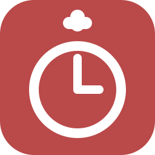

<!-- TODO: one day consider stylized SVG title headers instead of plain markdown headings -->



# Pomodoro Overlay

> A lightweight desktop overlay timer that stays on top of your work, built with Tauri.


---

## About

A Pomodoro timer that lives as a small, always-on-top overlay on your desktop. It stays out of the way when you don't need it and fades in when you hover. Supports work, short break, and long break phases with auto-advance, custom sounds, DnD mode, and a fullscreen break screen.

Built with Tauri 2 and vanilla TypeScript. No Electron - the app is a native Windows binary with a small WebView for UI.

---

## How to run

```bash
npm install
npm run tauri dev
```

To build a release:

```bash
npm run tauri build
```

Releases are also published automatically via GitHub Actions on push to `main`.

---

## Features

- Resizable, draggable overlay with corner snap
- Focus, Short Break, Long Break phases
- Auto-start work / break phases
- Custom notification sound or built-in synth beep
- Pause music on break (Windows Media Session API)
- Do Not Disturb mode during focus (Windows registry)
- Fullscreen break screen with snooze
- Settings window with live updates
- System tray with show/hide/quit
- Launch at startup
